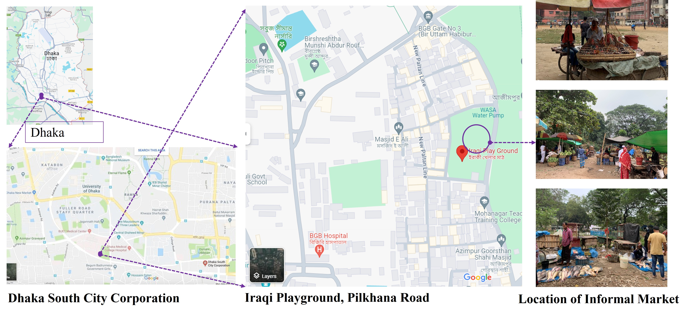
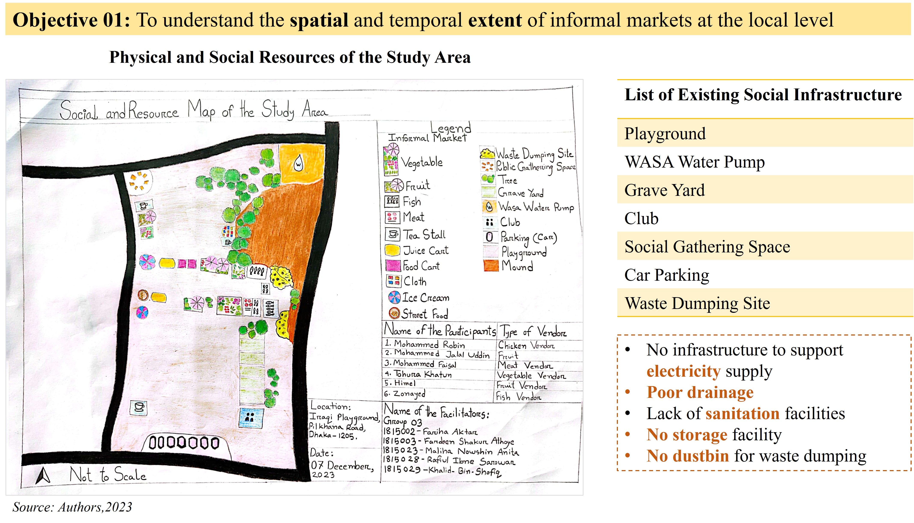
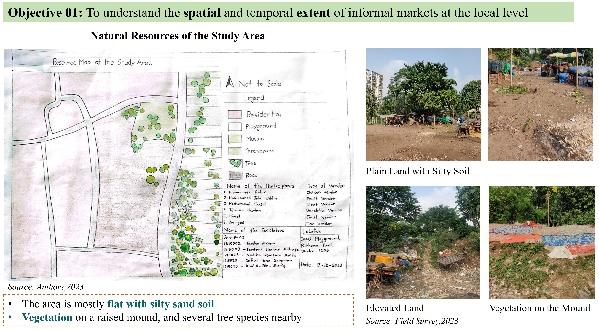

## <i> **📘 Project Title:** A Study on Informal Market at the Local Level and the Role of Stakeholders</i>

**🎯 Objectives**
- To understand the spatial and temporal extent of informal markets at the local level. 
- To identify and analyze the problems faced by informal businessmen and users.  
- To explore the relationship and role of stakeholders in informal markets at the local level.

**🗺️ Location of the Study Area**  
  

    
  

    
  ### 📊 Results 

- **Physical and Social Resources of the Study Area**
  

    
  

- **Natural Resources of the Study Area**
  

    
  

  

  
<b>📊 Major Findings — <i>Click to view</i></b>
 

📍 **Location: mixed suitability**
  - **Advantages:** steady demand from nearby households; little congestion or pedestrian conflict.
  - **Disadvantages:** space conflicts on the playground; weak visibility/access from New Polton Lane; limited reach beyond the neighborhood.

🏗️ **Infrastructure: basic water, other gaps**
  - Access to WASA pump.
  - Deficits in sanitation, drainage, storage and waste bins.

⚖️ **Management & vendor rights: informal and precarious**
  - Operations depend on relationships with local leaders/ward office; no formal committee.
  - No legal tenure → exposure to **extortion, eviction**, space disputes, restricted hours.

⏱️ **Temporal dynamics: strong seasonality and event effects**
  - **Seasonal:** vegetables (winter/spring), fruits (summer), fish (monsoon).
  - **Weekly:** peak on **Fridays**; spikes during sports events (Fri–Sat).
  - **Festivals:** Boishakh ↑ fish; Eid-ul-Azha ↓ fish; Ramadan ↑ fruits.
  - **Daily/External:** longer commutes and gender roles affect routines (esp. male vendors); rain, waterlogging, and heat disrupt storage and trading.

🗑️ **Waste management: inadequate**
  - Open dumping due to lack of designated sites → pollution at the market.
  - Local sweeper aggregates waste; DSCC removes it; vendors pay a daily fee.

🧑‍🤝‍🧑 **Customer perceptions: price and environment concerns**
  - Price hikes linked to extortion/maintenance costs and rainy-season scarcity.
  - Complaints about playground disruption, child safety, hygiene, and impacts on privacy/security of nearby residents.

  
 

  

- 
 <b> Field Survey - December 7, 2023 </b> 

  

    
  

