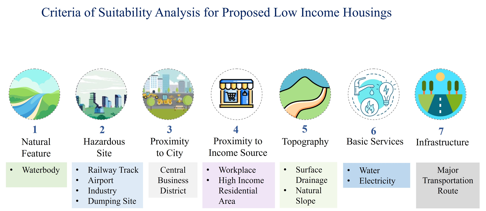
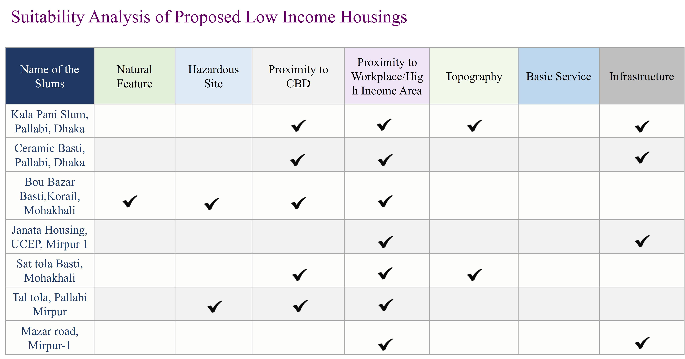
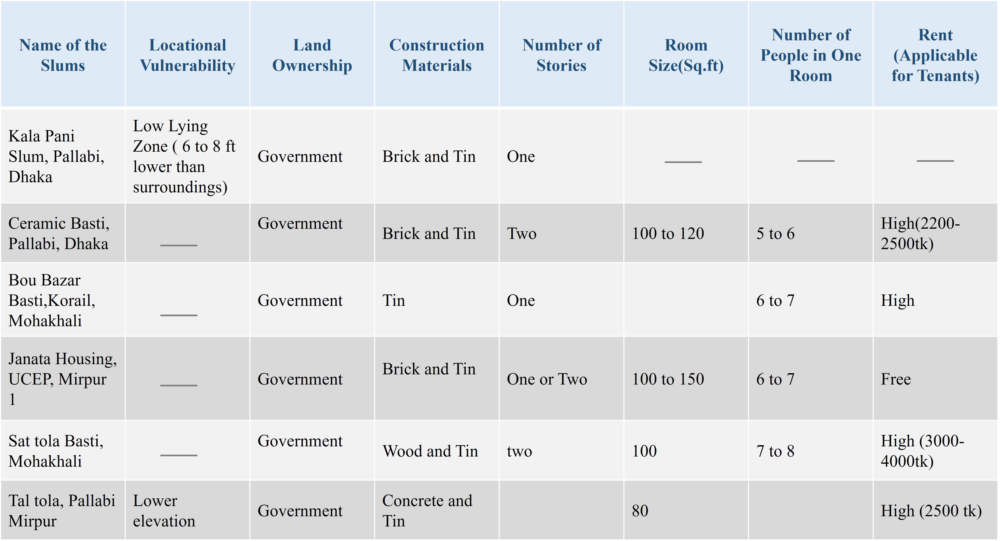
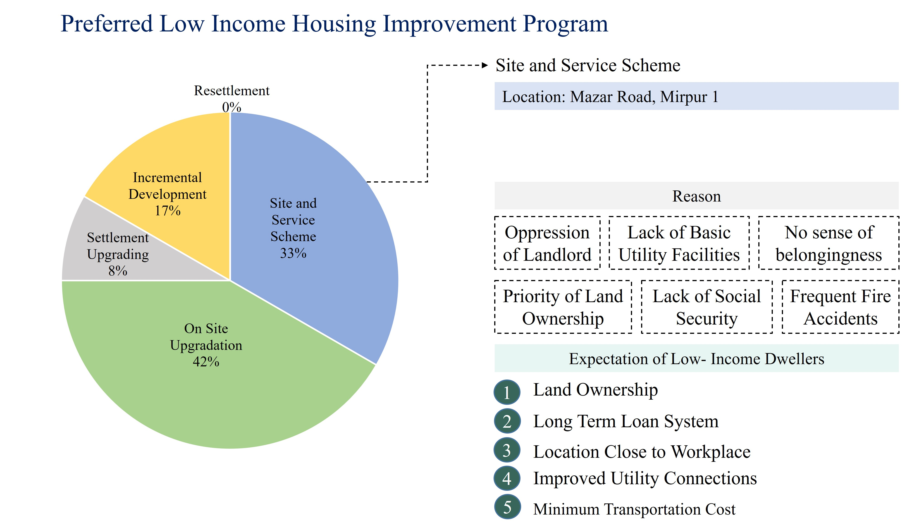
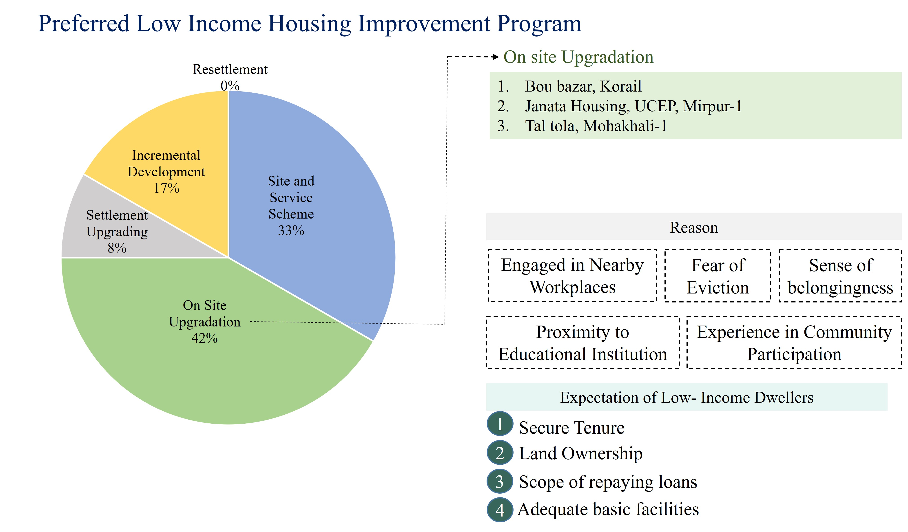

## <i>**📘 Project 1:** Potentials of slum improvement in proposed low-income settlements in DAP</i>  

**Project Type:** Policy level project  

**🎯 Objective** 
1. To review DAP strategy in consideration of structure plan proposal.
2. To identify the potentials of slum upgradation in the proposed location in DAP.
 

    

 

## 📊 Result

    

    

    

    

 

  
 

## <i>**📘 Project 2:** Potentials of development in proposed MRT station areas - A study on Agargaon MRT station. </i>  

**Project Type:** Design project  

**🎯 Objective** 
1. To explore the land use pattern and socioeconomic context in surround areas of Agargaon MRT station. 
2. To propose a land use plan compatible with the MRT station in the study area.  
 

  
 
  
