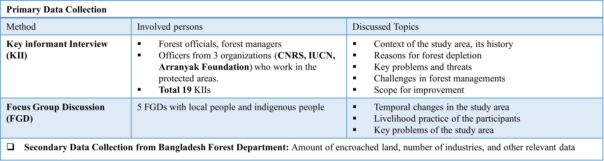
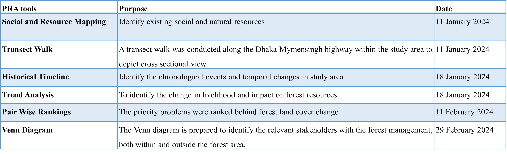
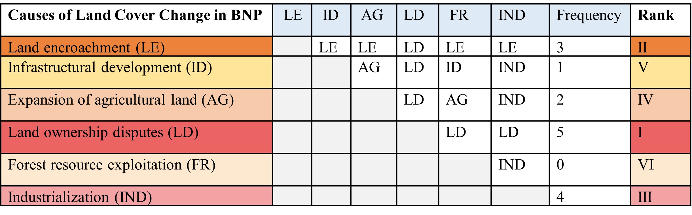
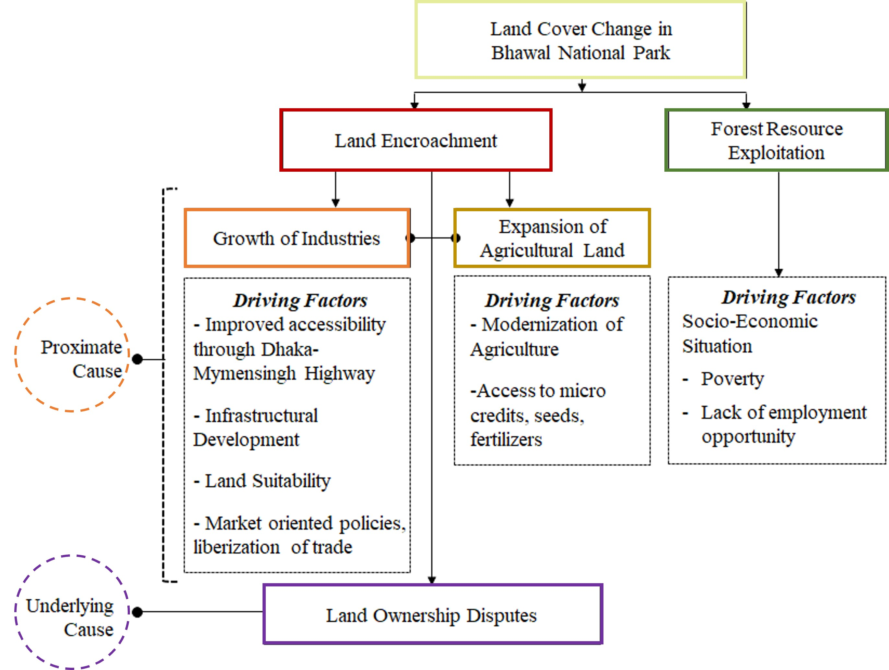

# Thesis: Exploring the Reasons Behind Land Cover Change & Evaluating Management Strategies of a Protected Area in Bangladesh

[← Back to profile](../)

## Objectives
1. To explore the reasons behind land cover change of a selected protected area in Bangladesh. 
2. To evaluate management strategies for the selected protected area.

## Methodology

  
<em>Data Collection</em>

  

    
  

  
<em>Application of Participatory Rural Appraisal Tools</em>

  

    
  

  
<em>Application of Management Effectiveness Tracking Tool (METT)</em>

  

    
  

## Results

  
<em>Social and Resource Map of the Study Area</em>

  

    
  

  
<em>Temporal Change in the Study Area</em>

  

    
  

  
<em>Pair Wise Matrix for Identifying the Major Causes Behind Land Cover Change</em>

  

    
  

  
<em>Reasons behind Land Cover Changes of the Study Area</em>

  

    
  

  
<em>Change in Land Ownership of the Study Area</em>

  

    
  

  
<em>Land Encroachment</em>

  

    
  

  
<em>Change in Local Livelihood Options</em>

  

    
  

  
<em>Identification of Possible Threats to the Study Area & Threat Extent and Severity</em>

  

    
  

  
<em>Stakeholders Associated with the Management of Bhawal National Park</em>

  

    
  

  
<em>Stakeholders Associated with the Management of Bhawal National Park</em>

  

    
  

## Key Findings
- Forestlands are increasingly encroached by industries & settlements.  
- Institutional capacity is weak; eviction cases largely ineffective.  
- Local communities excluded from decision-making.  
- Current management is **ineffective** for long-term conservation.

